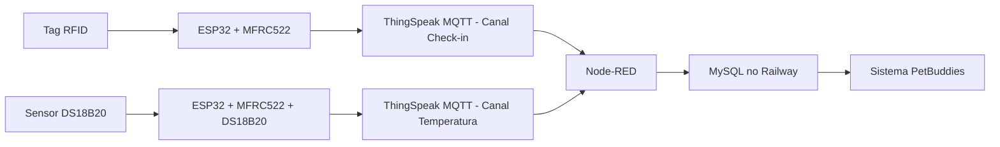

# PetBuddies - IoT

Projeto de IoT do grupo **BugBuddies** para o ecossistema **PetBuddies**. A proposta é simular dispositivos conectados para apoiar uma clínica veterinária, registrando eventos de check-in por RFID e leituras de temperatura associadas ao pet.

> Integrantes:
>
> - Nome do integrante 1 - RM000000
> - Nome do integrante 2 - RM000000
> - Nome do integrante 3 - RM000000
> - Nome do integrante 4 - RM000000

## Por Que Montamos Este Circuito

O PetBuddies é um sistema voltado ao acompanhamento de pets em ambiente veterinário. Dentro desse contexto, o circuito IoT foi pensado para automatizar duas situações comuns da rotina de atendimento:

- identificar a chegada de um pet na recepção por meio de uma tag RFID;
- registrar a temperatura do pet associada ao UID da tag RFID.

Com isso, o sistema reduz registros manuais, evita perda de informações e cria uma base de dados que pode ser consumida por outras partes da aplicação PetBuddies.

## Como o Sistema Funciona

O projeto é dividido em dois protótipos simulados no Wokwi.

O primeiro protótipo é o **Check-in PetBuddies**. Ele usa um ESP32 conectado a um leitor RFID MFRC522. Quando uma tag é aproximada, o ESP32 lê o UID da tag e publica esse dado em um canal privado do ThingSpeak usando MQTT.

O segundo protótipo é o **Temperature PetBuddies**. Ele usa o mesmo conceito de identificação por RFID, mas também lê a temperatura pelo sensor DS18B20. O ESP32 publica o UID e a temperatura em outro canal privado do ThingSpeak.

O Node-RED assina os canais MQTT do ThingSpeak, trata os dados recebidos e envia as informações para um banco MySQL hospedado no Railway.



## Estrutura do Repositório

```txt
.
├── CheckIn PetBuddies/
│   ├── sketch.ino
│   └── libraries.txt
├── Temperature PetBuddies/
│   ├── sketch.ino
│   └── libraries.txt
├── node-red/
│   ├── flows.json
│   └── README.md
├── CREDENCIAIS.md
├── README.md
├── docs/
│   └── README.md
└── database/
    └── schema.sql
```

Sugestao para evolucao da estrutura:

```txt
docs/
  prints-wokwi/
  prints-thingspeak/
  prints-node-red/
```

## Tecnologias Utilizadas

### Hardware Simulado

- ESP32
- Leitor RFID MFRC522
- Tag/cartão RFID
- Sensor DS18B20
- Resistor de 4.7 kOhm para o barramento OneWire do DS18B20

### Bibliotecas Arduino

- `WiFi.h`
- `PubSubClient.h`
- `SPI.h`
- `MFRC522.h`
- `OneWire.h`
- `DallasTemperature.h`

### Plataformas

- **Wokwi**: simulação dos circuitos e execução dos sketches.
- **ThingSpeak**: servidor MQTT privado e visualização dos dados por canais.
- **Node-RED**: integração entre ThingSpeak e banco de dados.
- **Railway**: hospedagem do banco MySQL.
- **MySQL**: persistência dos registros.
- **GitHub**: versionamento e documentação do projeto.

## Montagem Física do Circuito

### Check-in PetBuddies

Componentes:

- ESP32
- MFRC522
- Tag RFID

Pinagem utilizada:

| MFRC522 | ESP32 | Função |
| --- | --- | --- |
| SDA/SS | GPIO 5 | Seleção SPI |
| SCK | GPIO 18 | Clock SPI |
| MOSI | GPIO 23 | Dados SPI |
| MISO | GPIO 19 | Dados SPI |
| RST | GPIO 22 | Reset do módulo |
| 3.3V | 3.3V | Alimentação |
| GND | GND | Terra |

Funcionamento: quando a tag RFID é aproximada do leitor, o ESP32 captura o UID e envia ao ThingSpeak:

```txt
field1 = UID
field2 = recepcao
```

### Temperature PetBuddies

Componentes:

- ESP32
- MFRC522
- Tag RFID
- DS18B20
- Resistor de 4.7 kOhm

Pinagem adicional do DS18B20:

| DS18B20 | ESP32 | Função |
| --- | --- | --- |
| DATA | GPIO 4 | Barramento OneWire |
| VCC | 3.3V | Alimentação |
| GND | GND | Terra |

O resistor de 4.7 kOhm deve ficar entre o pino DATA do DS18B20 e o 3.3V. Sem esse resistor, o sensor pode retornar erro de leitura.

Funcionamento: quando a tag RFID é lida, o ESP32 também lê a temperatura e envia ao ThingSpeak:

```txt
field1 = UID
field2 = temperatura
```

## Configuração Para Fazer Funcionar

### 1. Configurar o ThingSpeak

Crie dois canais privados:

Canal de check-in:

```txt
field1 = uid
field2 = local
```

Canal de temperatura:

```txt
field1 = uid
field2 = temperatura
```

Depois crie devices MQTT no ThingSpeak em:

```txt
ThingSpeak > Devices > MQTT
```

Cada device precisa ter permissão no canal correspondente. Os valores gerados devem ser preenchidos localmente nos sketches.

### 2. Configurar os Sketches

No arquivo `CheckIn PetBuddies/sketch.ino`, altere:

```cpp
const char* THINGSPEAK_CHANNEL_ID = "SEU_CHANNEL_ID_CHECKIN";
const char* MQTT_CLIENT_ID = "SEU_CLIENT_ID_MQTT";
const char* MQTT_USER      = "SEU_USERNAME_MQTT";
const char* MQTT_PASS      = "SUA_SENHA_MQTT";
```

No arquivo `Temperature PetBuddies/sketch.ino`, altere:

```cpp
const char* THINGSPEAK_CHANNEL_ID = "SEU_CHANNEL_ID_TEMPERATURA";
const char* MQTT_CLIENT_ID = "SEU_CLIENT_ID_MQTT";
const char* MQTT_USER      = "SEU_USERNAME_MQTT";
const char* MQTT_PASS      = "SUA_SENHA_MQTT";
```

O broker MQTT usado pelos dois sketches é:

```txt
mqtt3.thingspeak.com
porta 1883
```

### 3. Configurar o Node-RED

Importe o arquivo `node-red/flows.json` no Node-RED.

O fluxo possui duas entradas MQTT:

- `channels/SEU_CHANNEL_ID_CHECKIN/subscribe`
- `channels/SEU_CHANNEL_ID_TEMPERATURA/subscribe`

Para cada broker MQTT do Node-RED, configure:

```txt
Server: mqtt3.thingspeak.com
Port: 1883
TLS: desativado
Client ID: client id MQTT do ThingSpeak
Username: username MQTT do ThingSpeak
Password: password MQTT do ThingSpeak
QoS: 0
```

Use Client IDs diferentes dos usados pelos ESP32. Quando dois clientes MQTT usam o mesmo Client ID, uma conexão pode derrubar a outra.

### 4. Configurar o Banco MySQL no Railway

Crie um banco MySQL no Railway e copie os dados de conexão:

```txt
host
port
database
user
password
```

No Node-RED, configure o node MySQL com esses dados. O fluxo usa SQL parametrizado por meio de `msg.topic` e `msg.payload`.

Para o check-in:

```sql
INSERT INTO CheckInPet (uid, local, data_checkin, hora_checkin) VALUES (?, ?, ?, ?)
```

Para temperatura:

```sql
INSERT INTO LeiturasPet (uid, temperatura, timestamp_ms) VALUES (?, ?, ?)
```

O script de criação das tabelas está em `database/schema.sql`.

## Resultados Parciais

- O ESP32 conectou ao Wi-Fi simulado do Wokwi.
- O leitor MFRC522 conseguiu capturar o UID das tags RFID.
- O sensor DS18B20 retornou leituras de temperatura em Celsius.
- Os dois sketches publicaram dados em canais privados do ThingSpeak via MQTT.
- O Node-RED conseguiu assinar os canais do ThingSpeak.
- O fluxo do Node-RED preparou os dados para gravação no MySQL do Railway.

## Observações Sobre Segurança

Credenciais reais não devem ser publicadas no GitHub. Consulte `CREDENCIAIS.md` para saber quais valores precisam ser preenchidos localmente e quais arquivos não devem ser enviados com dados sensíveis.
